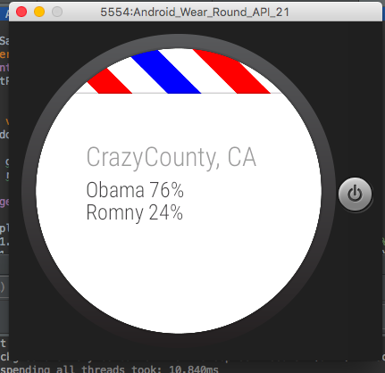

# PROG 02: Represent!

Represent! is a mobile and smartwatch application that delivers facts to voters on the go.

## Authors

Angela Kuo ([akuo5@berkeley.edu](mailto:akuo5@berkeley.edu))

## Demo Video

See [Represent!] (https://youtu.be/qH4K2waa8sE)

## Screenshots

## Acknowledgments

Thanks to staff and StackOverflow for the helpful tips and code.
